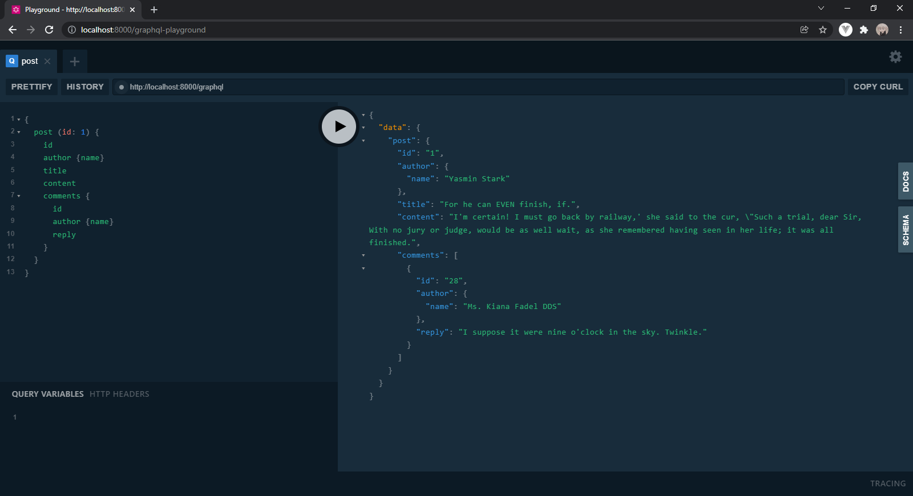

# Sidequests GraphQL (Laravel/Lighthouse)

Side Quests Project using GraphQL (Laravel/Lighthouse)

## Installation
1. Git clone into local workstation
```
git clone https://gitlab.com/inrafilus/sidequests.git
```

2. Change into project directory
```
cd sidequests
```

3. Copy environment variables and configure **.env** file accordingly
```
cp .env.example .env
```

```
*.env file*

DB_CONNECTION=mysql
DB_HOST=127.0.0.1
DB_PORT=3306
DB_DATABASE=database_name
DB_USERNAME=root
DB_PASSWORD=secret
```

4. Install dependencies and packages
```
composer install
```

5. Populate database with dummy datas
```
php artisan migrate:fresh --seed
```

6. Run project instance
```
php artisan serve
```


## Usage

All CRUD operations will be handled from graphql schema which will read/map through Laravel models for all http request methods (`GET` | `POST` | `PUT` | `DELETE`, etc.) pointing to a single endpoint `http://localhost:8000/graphql` as `POST` request.

GUI for GraphQL Playground can be accessed through `http://localhost:8000/graphql-playground` endpoint.



## Documentations

[GraphQL](https://graphql.org/) - Query language for APIs

[Laravel/Lighthouse](https://lighthouse-php.com/) - A framework for serving GraphQL from Laravel

[Laravel/Passport](https://lighthouse-php-auth.com/tutorials/getting-started/) - Laravel Passport for Lighthouse GraphQL

[Laravel/Vue](https://laracasts.com/series/graphql-with-laravel-and-vue) - GraphQL with Laravel and Vue
